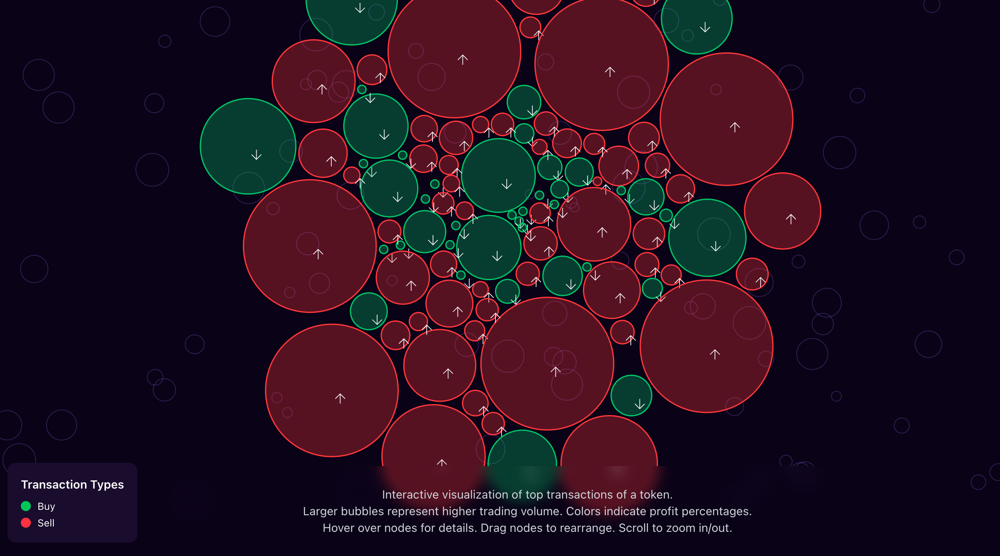
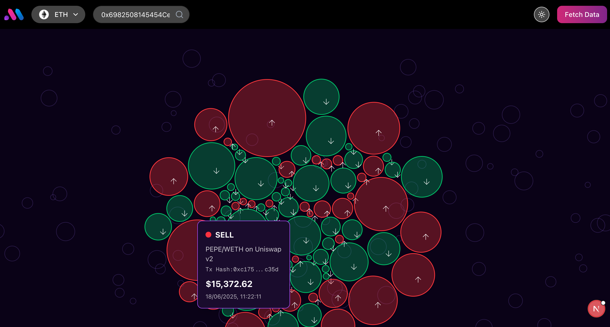

# BubbleMaps Top Trader's Visualization Tool

This project displays the **top traders of a token within 24 hours** using interactive and innovative visualizations. It mirrors the Bubblemaps experience, focusing on connecting and visualizing the top traders for any specific token.

## Features

- **Token Visualization:** Visualizes top token traders and their transactions in the last 24 hours.
- **Multi-Chain Support:** Supports multiple blockchain networks, including Ethereum, Arbitrum, Avalanche, Binance Smart Chain, Cronos, Fantom, Polygon, and Solana.
- **Token Metadata:** Fetches and displays token metadata, such as name, symbol, and decimals.
- **UI Components:** Utilizes `shadcn/ui` for a modern and accessible user interface.
- **Theme Toggling:** Allows users to toggle between light and dark themes.

## Technologies Used

- [Next.js](https://nextjs.org): A React framework for building performant web applications.
- [TypeScript](https://www.typescriptlang.org): A typed superset of JavaScript.
- [shadcn/ui](https://ui.shadcn.com): A collection of accessible and reusable UI components.
- [zustand](https://github.com/pmndrs/zustand): A small, fast, and scalable bearbones state-management solution.

## Getting Started

1.  Clone the repository:

    ```bash
    git clone <repository_url>
    ```

2.  Install dependencies:

    ```bash
    npm install
    # or
    yarn install
    # or
    pnpm install
    # or
    bun install
    ```

3.  **Set up environment variables:**

- Create a `.env.local` file in the root directory.
- Add your Moralis API key:
  ```
  NEXT_PUBLIC_MORALIS_API_KEY=your_moralis_api_key_here
  ```

4.  Run the development server:

    ```bash
    npm run dev
    # or
    yarn dev
    # or
    pnpm dev
    # or
    bun dev
    ```

5.  Open [http://localhost:3000](http://localhost:3000) with your browser to see the result.

## Project Structure

The project structure is organized as follows:

- `app/`: Contains the Next.js application pages and layouts.
  - `app/page.tsx`: The main page of the application.
  - `app/layout.tsx`: The root layout of the application.
  - `app/(demo)/`: Contains the demo section of the application.
    - `app/(demo)/app/page.tsx`: The main page of the demo section.
    - `app/(demo)/_ui/`: Contains UI components specific to the demo section.
- `components/`: Contains reusable React components.
  - `components/floating-tokens.tsx`: Component for visualizing token distributions.
  - `components/navbar.tsx`: The navigation bar component.
  - `components/toggle-theme.tsx`: Component for toggling between light and dark themes.
  - `components/ui/`: Contains `shadcn/ui` components.
- `config/`: Contains configuration files.
  - `config/network.ts`: Configuration for blockchain networks.
- `constants/`: Contains constant values.
  - `constants/index.ts`: Constant values for the application.
- `context/`: Contains React context providers.
  - `context/bubble-context.tsx`: Context provider for managing bubble map state.
- `lib/`: Contains utility functions and theme providers.
  - `lib/theme-providers.tsx`: Theme provider for applying themes.
  - `lib/utils.ts`: Utility functions for the application.
- `public/`: Contains static assets.
- `service/`: Contains data fetching services.
  - `service/fetchData.ts`: Service for fetching data from APIs.
- `types/`: Contains TypeScript type definitions.
  - `types/index.ts`: Type definitions for the application.

## Configuration

The application can be configured using the following files:

- `config/network.ts`: Configure the supported blockchain networks and their respective details.

## Contributing

Contributions are welcome! Please feel free to submit pull requests or open issues for any bugs or feature requests.

## How to Use

1.  Select a blockchain network from the dropdown menu.
2.  Enter the token address in the input field.
3.  The app will display a bubble map of the top traders of the token within the last 24 hours.
4.  Each bubble represents a trader, and the size of the bubble corresponds to the trader's trading volume.
5.  Hover over a bubble to see the trader's address and trading volume.

## Screenshots

Below are images of the app in action:

### Home Page



### Token Visualization



---

## License

[MIT](LICENSE)
